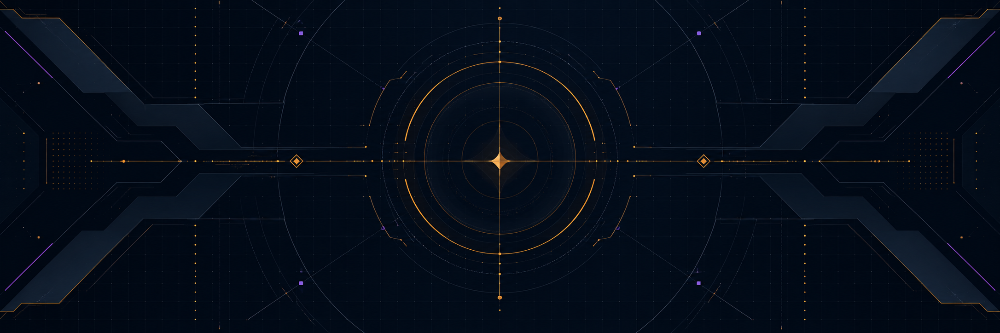
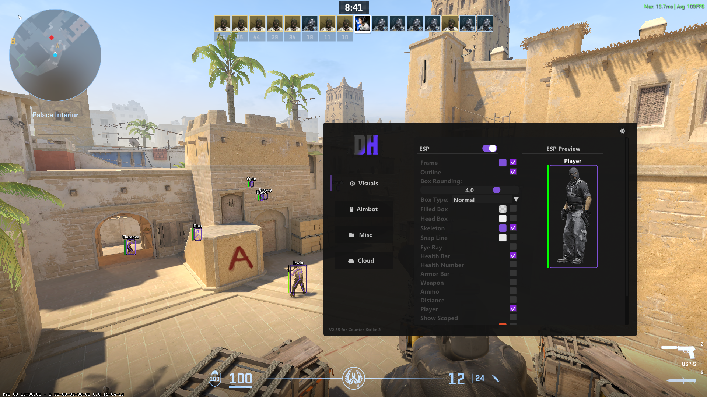
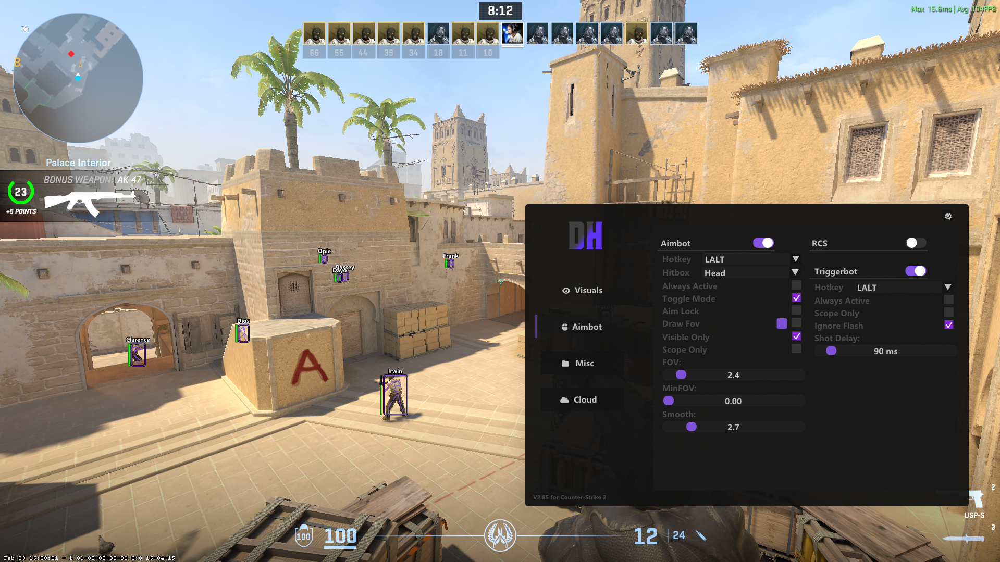
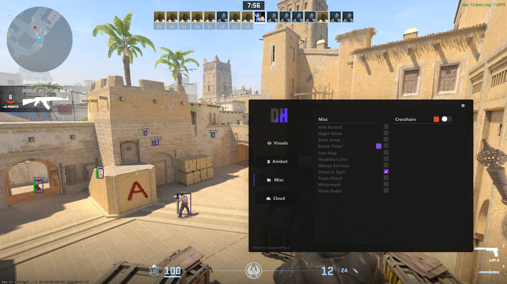
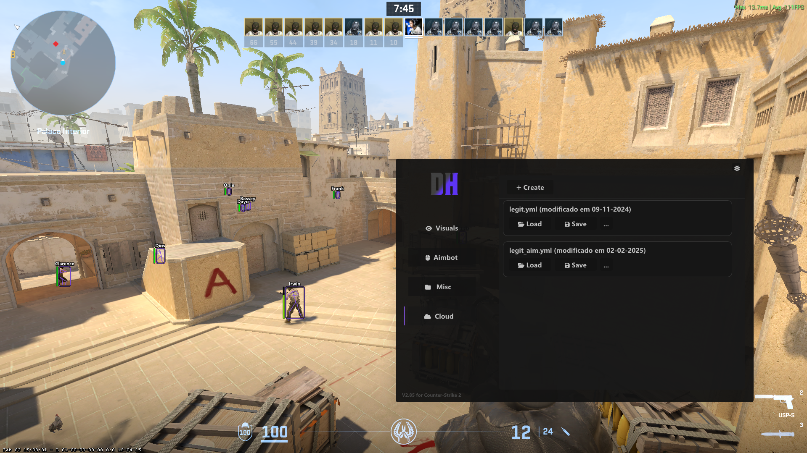

  

<h1 align="center">DH Free CS2 External</h1>

  <strong>The official repository for the free DH external tool for Counter-Strike 2.</strong> 
  Download the current Windows build, check service status and get help from official DH channels.

  
  
  

  
  
  
  

  <a href="#overview">Overview</a> ·
  <a href="#interface-preview">Preview</a> ·
  <a href="#free-version">Features</a> ·
  <a href="#installation">Installation</a> ·
  <a href="#help-and-support">Support</a>

> [!IMPORTANT]
> Download only from this repository or from links on **dhjcheats.com**. Game updates and anti-cheat systems can change compatibility at any time, so check the [live status](https://dhjcheats.com/en/status) before use. No software can guarantee zero risk.

## Overview

<table>
  <tr>
    <td width="33%" valign="top">
      <h3>External interface</h3>
      
A focused overlay with configurable visual and recoil-control options.

    </td>
    <td width="33%" valign="top">
      <h3>Simple setup</h3>
      
Download one archive, extract it and open the menu with <code>INSERT</code>.

    </td>
    <td width="33%" valign="top">
      <h3>Official updates</h3>
      
The current public package is always published through the repository release page.

    </td>
  </tr>
</table>

## Interface preview

  
  

  
<strong>View additional interface screens</strong>

   
  

    
    
  

## Free version

| Included | Description |
| --- | --- |
| Player ESP | On-screen player information and configurable visual elements |
| ESP options | Individual controls for the information displayed |
| Recoil assistance | Configurable recoil control support |
| External menu | Open or close the interface with `INSERT` |

For the complete feature set, visit the [CS2 Premium product page](https://dhjcheats.com/en/cheats/cs2/premium).

## System requirements

| Requirement | Supported configuration |
| --- | --- |
| Operating system | Windows 10 or Windows 11, 64-bit |
| Game | Counter-Strike 2 installed through Steam |
| Archive utility | Windows “Extract All”, 7-Zip, or equivalent |
| Permissions | Administrator access may be required to launch `DH.exe` |

## Installation

1. Open the **[latest release](https://github.com/Dhjcheats/cs2-external-cheat/releases/tag/updates)**.
2. Under **Assets**, download `DH.zip` — not GitHub's automatically generated source-code archives.
3. Scan the archive with your installed security software.
4. Extract it to a dedicated folder such as `C:\DH`.
5. Start Counter-Strike 2 and remain at the main menu.
6. Run `DH.exe` as administrator if Windows requests elevated permissions.
7. Press `INSERT` to open or close the menu.

Do **not** permanently disable antivirus, firewall or Windows security protections. Security tools may flag game-modification software because of how it interacts with other processes; review a warning instead of automatically ignoring it.

## Help and support

<table>
  <tr>
    <td width="50%" valign="top">
      <h3>Something is not working?</h3>
      
Read the <a href="./SUPPORT.md">support guide</a> or open a structured bug report in GitHub Issues.

    </td>
    <td width="50%" valign="top">
      <h3>Account, payment or access?</h3>
      
Use the <a href="https://dhjcheats.com/en/support">official DH support page</a>. Never share private account data in a public issue.

    </td>
  </tr>
</table>

  
<strong>Quick troubleshooting</strong>

   

| Problem | What to check |
| --- | --- |
| Menu does not open | Press `INSERT`; on compact keyboards, also try `Fn` + `INSERT`. |
| Tool closes after a CS2 update | Check the [live status](https://dhjcheats.com/en/status) and download the newest release. |
| Archive will not extract | Download `DH.zip` again from the official release page. |
| Windows blocks the file | Confirm the source, review the security alert and contact support if you are unsure. |

## Official links

- [Free CS2 product page](https://dhjcheats.com/en/cheats/cs2/free)
- [Latest GitHub release](https://github.com/Dhjcheats/cs2-external-cheat/releases/tag/updates)
- [Live status](https://dhjcheats.com/en/status)
- [Official support](https://dhjcheats.com/en/support)
- [All available products](https://dhjcheats.com/en/cheats-available)
- [Security policy](./SECURITY.md)

## Safety and disclaimer

- Never share your DH account password or payment information in a GitHub issue.
- DH does not provide support through unofficial mirrors or reuploaded files.
- Using third-party game tools may violate the game's terms and can result in account restrictions. You are responsible for deciding whether and where to use this software.
- DH is not affiliated with or endorsed by Valve Corporation. Counter-Strike and Steam are trademarks of their respective owners.

---

  <strong>DH Free CS2 External</strong> 
  Official downloads · Current status · Direct support

